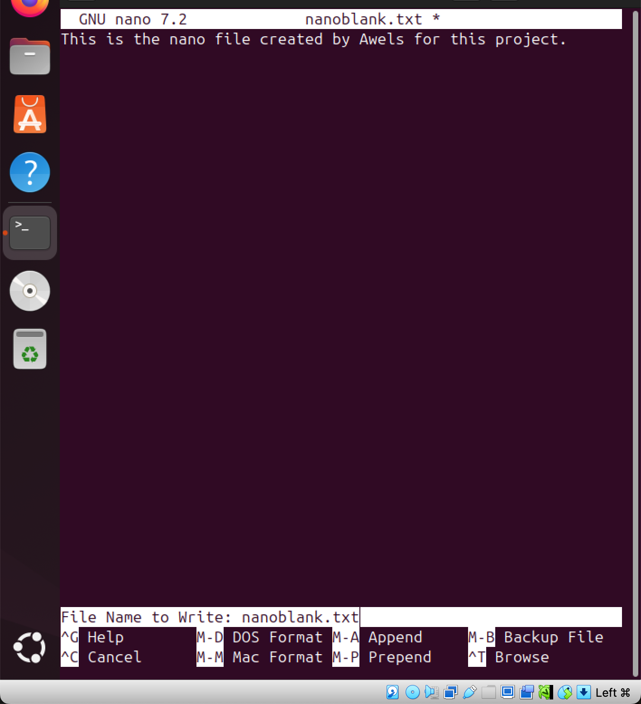

# linux_Text_Editors
a project on Linux text editors

The first linux text editor we would be working with is called the Vim. it is a versatile and very powerful linux text editor and ti get this running, the command to use is the "vim blank.txt". this automatically creates the file caled blank.txt and then opens the text editor for us to add content to it. 

below is the pictoral explanation of the above statements. 

the above picture is before running the command. the image below depicts that the command was succesful and it created a new file called 'blank.txt' and opened the vim text editor.

this command was done smoothly and successfully.

The next thing is to add content in the vim text editor 

I wrote on my Vim text editor ' Hello, this is a vims hands on project. welcome to darey..'

this is done by clicking letter i which stands for insert. below is the result I got from doing this. 

to navigate and move around the vim text editor, this is done by using the arrow key or using 'h' for left, 'j' for down, 'k' for up and 'I'for right. 

# How to delete on the Vim Text Editor. 

this is done by first clicking on the escape 'esc' key to exit the insert mode. then position the cursor on where you want to delete and click 'x' orafter exiting the insert mode, place your cursor and click backspace to delete. 

below is the befor and the after lookn of running this above 

  

this is the effct of not doing the above 

then the result of doing the above mentioned. 

the above is the result of running the above. in summary you can delete anything using the escape 'esc' to exit the insertmode and then take the cursur to the area you wish to delete and click on 'x' or backspace 

# How to delete a line on Vim Text Editor. 

this is done by simply clicking on tthe escape key 'esc' to exit the insert mode and then going to the line we intend to delete and clicking the lettter 'd' two times. 

below is the image showing the new line I included to practice this

the next image below shows the result after clicking on the 'esc' key to exit the insert mode and taking the keyboard to the line that i intend to delete and clicking 'd'twice. this came out successful. 

# How to undo changes on a Vim Text Editor.

this is simply done by exiting the insert mode by clicking the 'esc key' and then clicking on 'u'

below is the current look of our Vim Text Editor before undoing the previous changes.

after running the above son the vim text editor and it came out succesful, below is the image that proves that. what we earlier deleted was restored because i undid the previous changes. 

# How to save changes on a Vim Text Editor

saving all the changes on content of a Vim text editor is done by first of all exiting the insert mode by clicking on the 'esc key' and then clicking on a colon and typing next to it 'wq' this immediately saves and quit. w in this means write and q means to quit. 

so in the end it should look like this ':wq'

below is the result of running the above.

the image below shows the result 

imediatly after ':wq' is that it immediately saved it and then took us back to the terminal. 

# How to not save changes on a Vim Text Editor

this is simply done by exiting the insert mode and then clicking a colon and q with an exclamation mark. so at the end it should look like this ':q!'

# NANO TEXT EDITOR 

Nano is a text editor that is beginner friendly. the next thing is to create the file with nano and open it up 
using the command 'nano nanoblank.txt' note: the name of the file i intend to create is called 'nanoblank.txt' 

this automatically creates a file called the nanoblank.txt and opens the nano text editor. you can immediatly start typing. 

the picture above shows the result after running the command on the terminal. it immediatly created a file named 'nanoblank.txt' an opened up the nano text editor. 

with nano text editor, you can immediately start typing without doing anything. 

above image shows the text i just wrote on my nano text editor and the result was successful. 

# How to save on Nano Text Editor

now that we have typed into the nano text editor, the  next action is to save and this can be done by clicking on 'control' and 'o'. it would immediatly ask you what name you would love to save the file as and once you are done with that it would immediatly save. 

below is the image that shows what happens after clicking on 'control' and 'o'

froom this image it shows that ia m being asked about the name i would love to save my file as and one i am done it will immediatly save and go back to my terminal. 

the image above shows the result and it was successful as it immediatly took me back to my terminal.

# How to open an existing file on Nano. 

this can easily be done by running this command on this terminal 'nano nanoblank.txt'
whixh is nano and the name of the existing file. this would immediatly open up the nano file and you can type and save the changes. 

the picture below shows this. after running the command, it opened the file in the text editor the earlier file that i was working on

# Note 
to move from different parts of the nano text editor, i use my arror keys.

# RESULT
## Vim
at the end of this project, i was able to make use of the vim text editor as well as navigate around it, i was able to learn how o use the 'esc' key and 'i' to insert and write anything on the text editor. if i want to delete anything, i have to click on 'esc' key to be able to leave the insert part and then move my cursor to the area that i intend to delete and click on 'x' or back space. 
if i intend to delete a line, all i have to do is to click on the 'esc' key and then click on 'd' twice as this would delete the full line. the next thing to dois to save. the way of saving on the Vim text editor is done by escapong out of the insert part and then clicking on ':wq' as this would save it and immediately take us back to the termkinal and to be able to exit without saving, this is done by using ':q!' as this would quit the text editor immediately and return us back to the terminal. it is worthy to note that to create a file and edit on the vim text editor, this iis done by typing vim and the name you intend to give the file and it will immediatly open.

## Nano
at the end of this project, i was able to understand the use of Nano as a text editor. nano is less complex and easy to understand. it is very beginner friendly. the first step is in create a file and open it in nao. this is done by clicking on 'nano' and the name of the file we intend to open. once this is done, we can type whatever we want and then move to saving it. this is done by clicking on "control' and then 'o'. once this command is done itb would ask you to give the file a name or save it with the existing name and once this is done it immediatly takes you back to the terminal which shows that it was successful. if we dont want to save a file on the nano text editor. this is done by using 'control' and 'x'. 

# in conclusion based on the results and images attached, this project was a great success. 